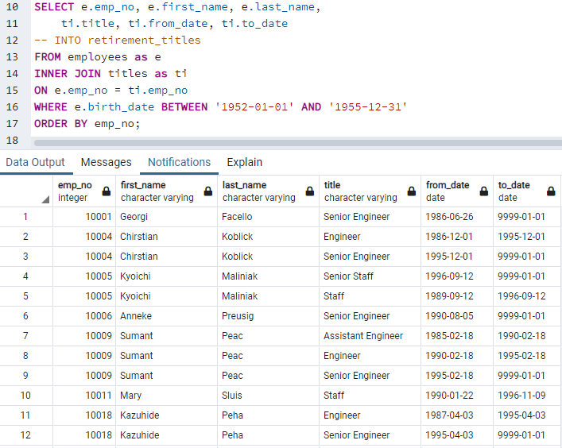
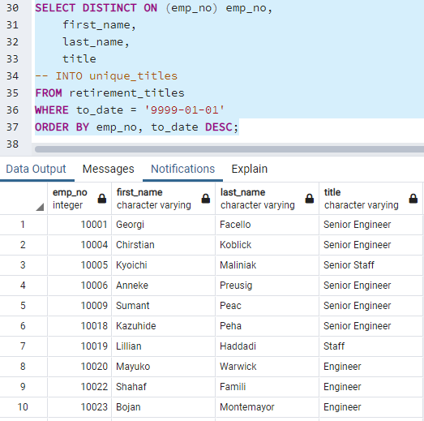
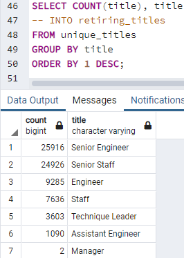
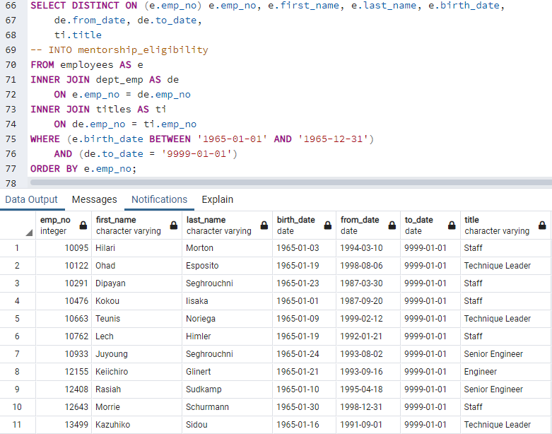

# Pewlett-Hackard-Analysis

## Overview of the Analysis
Pewlett-Hackard wants to know more about the upcoming "silver tsunami", more specifically, how many employees are retiring per title & identifying employees who are eligible to participate in a mentorship program. The firm may become understaffed and lack senior leadership. In this exercise we used pgAdmin 4 and SQL to build relevant tables to analyze Pewlett-Hackard's workforce.

## Results
- Retirement Titles Table
  - 
- Unique Titles Table
  - 
- Retiring Titles Table
  - 
- Mentorship Eligibility Table
  - 
- 
- 
- 
- 

Provide a bulleted list with four major points from the two analysis deliverables. Use images as support where needed.

## Summary
Provide high-level responses to the following questions, then provide two additional queries or tables that may provide more insight 
into the upcoming "silver tsunami."

- How many roles will need to be filled as the "silver tsunami" begins to make an impact?
- Are there enough qualified, retirement-ready employees in the departments to mentor the next generation of Pewlett Hackard employees?
