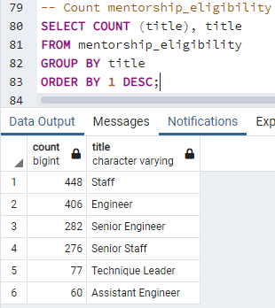

# Pewlett-Hackard-Analysis

## Overview of the Analysis
Pewlett-Hackard wants to know more about the upcoming "silver tsunami", more specifically, how many employees are retiring per title & identifying employees who are eligible to participate in a mentorship program. The firm may become understaffed and lack senior leadership. In this exercise we used pgAdmin 4 and SQL to build relevant tables to analyze Pewlett-Hackard's workforce.

## Results
- Retirement Titles Table
  - 
    - This table has a number of repeating employees, due to the table pulling employees multiple times if they had multiple jobs at Pewlett-Hackard.
- Unique Titles Table
  - 
    - The unique titles table is an improved version of the retirement titles table, it shows the current titles for employees.
- Retiring Titles Table
  - 
    - The retiring titles table shows us how many employees could potentially retire from each position. 
- Mentorship Eligibility Table
  - 
    - This table shows the employees born in 1965 that are eligible for mentorship. 
- 72,458 employees make up the "silver tsunami" at Pewlett-Hackard.
- There is a worrying number of employees approaching retirement, especially at the Senior Engineer & Senior Staff levels (50,842 workers).
- The number of employees in the mentorship eligibility table born in 1965 is 1,549. 
- There is a huge shortage of mentorship eligible employees to potentially retiring employees. Currently, there are only 2.13% of mentorship eligible employees to cover the potentially retiring employees.

## Summary
- How many roles will need to be filled as the "silver tsunami" begins to make an impact?
  - The retiring titles table shows a huge loss of Staff, Senior Staff, Engineers, Senior Engineers, & Others (72,456), but only 2 Managers retiring. 
- Are there enough qualified, retirement-ready employees in the departments to mentor the next generation of Pewlett Hackard employees?
  - As mentioned above, there are only 1,549 mentorship eligible candidates to fill in potentially 72,458 jobs. That is only 2.13% coverage with Pewlett-Hackard's current employees & parameters.
  - 
- Pewlett-Hackard needs to increase their pool of mentorship eligible candidates by expanding the birth date range from just 1965 to 1965 & beyond.
  - A potential example would be adjusting the mentorship_eligibility query:
    - WHERE (e.birth_date BETWEEN '1965-01-01' AND '1965-12-31') to WHERE (e.birth_date BETWEEN '1965-01-01' AND '1968-12-31')
  - The firm needs to also prepare to go enter a large hiring phase of Staff, Senior Staff, Engineers, and Senior Engineers to keep up with the impending "silver tsunami."